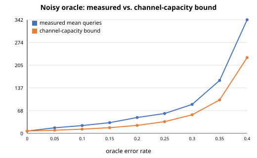

# search-bounds-verified


Empirically verifying information-theoretic lower bounds on search strategies -- and checking each claim against real data instead of just asserting it.

## Results at a glance

**Monte Carlo comparison: binary search, linear scan, and interpolation search**


100k trials, range size 100,000, seed 1. Bars are log-scaled (linear scan's mean is ~13,000x the other two -- on a linear axis they round to invisible), but the numbers printed above each bar are the real, unscaled means. Generated with:

```bash
./guess simulate --min 1 --max 100000 --trials 100000 --seed 1 --svg monte_carlo_chart.svg
```

**Noisy oracle: measured queries vs. the channel-capacity bound**



The gap between the two lines is the point, not a bug -- see [The noisy oracle](#the-noisy-oracle) below for why. Generated with:

```bash
./guess simulate --seed 1 --oracle-svg noisy_oracle_chart.svg
```

## What this does

Starts from a simple question: is binary search's `ceil(log2 N)` worst case actually optimal? The answer turns out to be "only under specific assumptions" -- and this repo makes each of those assumptions explicit, then tests where they break.

It also asks what happens when the oracle itself can't be trusted -- each answer wrong with some fixed probability, independently every time. `noisy_oracle_search.cpp` implements a Bayesian search (weighted-median query selection, posterior updated via Bayes' rule) that's provably consistent but not proven optimal, and the section below explains exactly where the gap is instead of hiding it.

```bash
./guess play                                          # you guess, computer thinks of a number
./guess demo                                          # computer guesses your number
./guess simulate --min 1 --max 100000 --trials 100000 --seed 1
```

`simulate` runs binary search, linear scan, and interpolation search against random secrets, checks the measured worst case against the theoretical bound (failing loudly with a non-zero exit code if they ever disagree), and reports a 95% confidence interval and a chi-square check on the RNG's uniformity. It also runs binary search, a greedy entropy-optimal heuristic, and Knuth's DP-optimal BST head-to-head under a skewed (Zipf) prior (the DP is capped at N=2000; it's O(N²) time and space, and this program's usual range sizes would exhaust memory), and the noisy oracle search under an unreliable yes/no channel.

| Flag | Effect |
|---|---|
| `--json` | machine-readable stats output |
| `--svg chart.svg` | binary/linear/interpolation bar chart |
| `--oracle-svg chart.svg` | noisy-oracle sweep chart |

All charts are native C++ SVG output -- no external plotting library.

## The math

Searching a space of $N$ equally likely values means resolving $\log_2 N$ bits of uncertainty. Each yes/no query can reveal at most 1 bit, so no decision procedure can beat $\lceil \log_2 N \rceil$ queries in the worst case -- this is what `informationTheoreticLowerBound` computes, and what `simulate` checks binary search against on every run.

Under a non-uniform prior $p$, the same idea generalizes: the Shannon entropy

$$H(p) = -\sum_i p_i \log_2 p_i$$

is the minimum expected number of yes/no queries needed, for *any* valid decision procedure, not just this one. `runWeightedComparison` checks binary search, a greedy entropy-optimal heuristic, and Knuth's DP-optimal BST against this exact bound under a Zipf-distributed prior.

### The noisy oracle

When the oracle itself can answer wrong with probability $p$, the relevant bound isn't $H(p)$ anymore -- it's the capacity of a binary symmetric channel:

$$\frac{\log_2 N}{1 - H(p)} \text{ queries}$$

This repo's implementation (`noisySearchAttempts` in `noisy_oracle_search.cpp`) does **not** hit that bound -- it's the simpler "probabilistic bisection algorithm" (Horstein, 1963), which is provably consistent (converges to the right answer with probability 1) but not bandwidth-optimal. Measured at N=300 across a sweep of error rates (the chart above): the gap between measured mean queries and the channel-capacity bound widens as the error rate climbs, consistently, not as sampling noise. Closing that gap would need something closer to an error-correcting code across queries (Karp & Kleinberg, 2007), which is a materially bigger algorithm, not a tweak.

## Bugs this project found

Nine real bugs surfaced while building and testing this, not while writing the original code -- each caught by an assertion, a test, or a sanity check actually firing, not by inspection:

1. **Off-by-one in the bound formula.** `ceil(log2 N)` is wrong at every exact power of two; the correct formula is the smallest `k` such that `2^k >= N+1`. Invisible with the old hardcoded default of N=100 (not a power of two); surfaced once N was parameterized and tested exhaustively at {1,2,4,8,...,128}, wrong at every single one.

2. **Interpolation search degenerated to a no-op.** Running interpolation search directly on scalar `[lo, hi]` range bounds instead of a real sampled array made its midpoint formula algebraically collapse to `mid = secret` -- it "found" the target on the first query almost every time. Fixed by searching an actual sorted array; measured mean went from a fake 1.0 to a real ~3.76 (matching the expected O(log log N)).

3. **RNG seeding was a silent no-op waiting to happen.** The RNG's seed was folded into a static local's default argument, which only takes effect on the very first call to that function -- any other code path calling it first would silently swallow `--seed` with no warning. Fixed by separating initialization from retrieval.

4. **Signed integer overflow at extreme ranges.** The bound calculation's bit-shifting was done in `long long`; an extreme `--max` (e.g. `LLONG_MAX`) triggers signed overflow, undefined behavior. Fixed with unsigned arithmetic.

5. **A yes/no vs. 3-way cost-model mismatch, caught mid-build.** Bridging Knuth's optimal BST into the entropy comparison initially measured it under Knuth's classical 3-way (early-exit-on-match) cost, then printed it next to strict yes/no query counts. Result: Knuth's mean landed *below* the Shannon bound H(p) -- mathematically impossible for a real yes/no procedure. Fixed by deriving a yes/no-consistent traversal from Knuth's split points instead, with a test guarding against the regression.

6. **CMake's Release build was silently disabling every test.** Release mode defines `NDEBUG`, which compiles out every `assert()` -- and `assert()` is this suite's only test mechanism. `cmake -B build && cmake --build build` (this README's own documented command) built a `tests` binary that ran zero actual checks and unconditionally printed "All tests passed." Caught by 8 "unused variable" compiler warnings on variables that only exist to feed asserts, then confirmed by deliberately breaking a real invariant and watching the Release build still report success. Fixed by explicitly un-defining `NDEBUG` for the `tests` target only.

7. **Belief ratio freezing permanently between two rival candidates.** The naive version of the noisy oracle search always queried the raw weighted-median cut of the posterior. If the two most likely candidates ever landed on the same side of that cut, every future query multiplied both of their beliefs by the identical factor -- their ratio was then frozen forever, and the algorithm could converge on the wrong candidate with arbitrarily high confidence. Fixed by forcing a direct query between the top two candidates once one has genuinely pulled ahead of a uniform prior.

8. **The fix for bug 7 used a stale baseline.** The "has one candidate pulled ahead" check compared against `1/(original range size)`, which never shrinks -- the belief array only zeroes out dead candidates, it never shrinks the array itself. As live candidates got eliminated, each survivor's share grew naturally just from having fewer rivals, eventually exceeding that stale threshold on a perfectly uniform residual cluster -- re-triggering the override anyway and degrading the search into an adjacent-index scan. Caught by a test asserting the search matches binary search's exact bound at error rate 0; it didn't, failing on 232 of 1000 secrets (verified by isolating and re-running the exact broken query-selection logic standalone, not estimated). Fixed by basing the threshold on the count of currently-live candidates instead of the original range size.

9. **A Windows-only segfault that had nothing to do with the code.** `--oracle-svg` crashed reliably at `-O2`/`-O3` but not `-O0`, which pointed at the optimizer at first -- a plausible but wrong theory, since it also crashed identically after removing every structured binding in the suspect function and under `-fno-tree-vectorize`/`-mstackrealign`, neither of which should matter if the code itself were fine. ASan, UBSan, and Valgrind all reported zero errors on Linux at the identical flags. A gdb backtrace on the actual Windows machine settled it: the crash was inside `libstdc++-6.dll` itself, one frame below `writeSvgLineChart` -- the executable had been compiled against MSYS2's UCRT64 GCC 16.2, but Git for Windows' own bundled `libstdc++-6.dll` (an older, ABI-incompatible build) was loading at runtime instead, because it sat earlier on `PATH`. `std::string` and `std::vector` disagreed about their own internal layout across that boundary, and the first substantial string/vector work corrupted memory. Fixed with `-static-libgcc -static-libstdc++`, added to `CMakeLists.txt` for MinGW builds, which removes the DLL dependency -- and therefore the PATH-order landmine -- entirely.

## What's actually verified, not just claimed

- Binary search's worst case matches the (corrected) bound exactly, asserted with a real pass/fail exit code, not just printed for inspection.
- Interpolation search's O(log log N) win on uniform data and its adversarial collapse toward O(N) on a constructed Fibonacci-spaced array -- both measured, not asserted.
- Entropy-optimal search and Knuth's DP-optimal BST both beat plain binary search under a skewed prior, and both are checked against the Shannon entropy lower bound H(p) using a matched yes/no query model (see [Bugs this project found](#bugs-this-project-found) above for why that match matters).
- The noisy oracle search is consistent (>99% empirical success rate across thousands of trials) but explicitly does **not** claim to hit the channel-capacity bound -- the gap is measured and reported by the program itself (`runNoisyOracleComparison`, `runNoisyOracleSweep`), not glossed over.
- The RNG's uniformity via chi-square test, and reproducibility via `--seed`, verified with byte-identical output across separate process launches.

## Build

```bash
g++ -std=c++17 -Wall -Wextra -Wpedantic number_guessing_game.cpp -o guess
g++ -std=c++17 -Wall -Wextra -Wpedantic -fsanitize=address,undefined tests.cpp -o tests
g++ -std=c++17 -Wall -Wextra -Wpedantic knuth_optimal_bst.cpp -o knuth_bst   # standalone worked example
g++ -std=c++17 -Wall -Wextra -Wpedantic noisy_oracle_search.cpp -o noisy_search  # standalone worked example
./tests
```

Or with CMake:

```bash
cmake -B build && cmake --build build
```

(defaults to Release; pass `-DCMAKE_BUILD_TYPE=Debug` to build `tests` with ASan/UBSan attached.)

> **Windows/MinGW notes:**
> - `-fsanitize=address,undefined` may fail to link on some MinGW toolchains (ASan/UBSan runtime not bundled). If so, drop the flag -- the tests themselves are unaffected, you just lose the extra memory-safety checking.
> - If `guess` itself segfaults (not `tests`), that's bug 9 above -- a `libstdc++` DLL version mismatch. Building via CMake picks up the `-static-libgcc -static-libstdc++` fix automatically. Building `guess` directly with `g++` instead of CMake needs those two flags added by hand.

## Reading the history

Each commit is a single, atomic change -- compiled and tested before being committed, not written after the fact. The commit messages explain the *why* behind each change, including the bugs listed above, most of which were caught by the testing infrastructure itself rather than planned in advance. `git log -p` tells that story in order.
